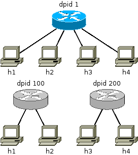
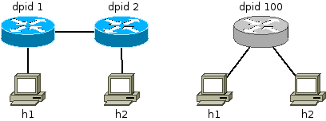
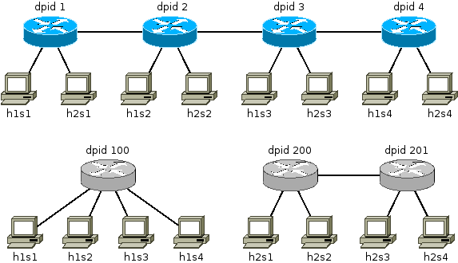
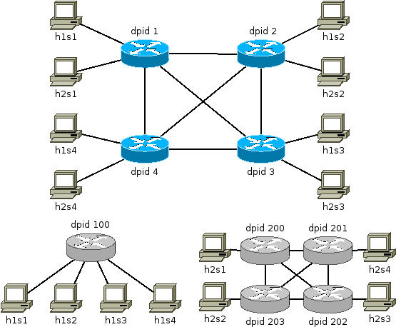
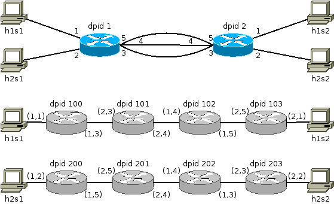

# Configuration

This directory contains some example configuration that work with Delftvisor. The physical networks are all standard mininet topologies or can be created in mininet using the file custom\_topos.py. In the images are the blue switches the physical switches and the grey switches virtual switches.

## Single 4
This topology consists of 1 switch with 4 hosts attached that get split into 2 virtual switches. This topology shows how Delftvisor can share a physical switch. It can be created in mininet with the topology single,4 and the configuration is in single\_4.json.

## Linear 2
This topology consists of 2 switches with a link between them. It shows how Delftvisor can abstract the topology of a virtual switch. In mininet is this the linear,2 topology and the configuration is in linear\_2.json.

## Linear 4,2
This topology consists of 4 switches with two hosts each. It shows how Delftvisor's topology abstraction can function at different levels, abstracting away only the details that the network operator wants to hide. The mininet topology is linear,4,2 and the Delftvisor configuration is in linear\_4\_2.json.

## Clique 4
This topology consist of 4 switches with 2 hosts each and links between each possible switch pair. It can be used to show the recovery functionality in Delftvisor, if you take down a link in mininet will Delftvisor re-route the relevant data if possible. In mininet is this the clique topology from the custom\_topos.py file and the Delftvisor configuration is in clique\_4.json.

## Shared links
This topology consist of 2 switches with 2 hosts each and with 3 links between the two switches. This topology should show that in Delftvisor on the wire are packets identified by slice and in a switch are packets identified by virtual switch id. This topology is the shared-links topology in the custom\_topos.py file and the Delftvisor configuration is in shared\_links.json.

